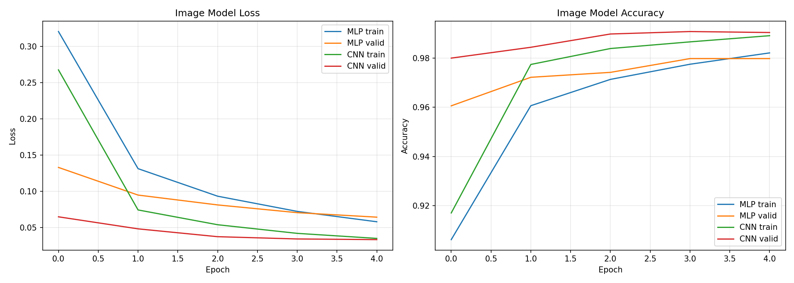
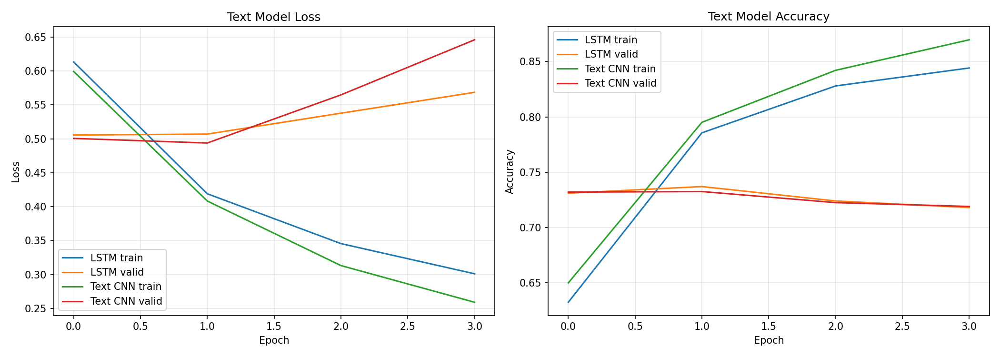

# Week 10 HW04 보고서

## 1. 사용 데이터

### 이미지 데이터: MNIST

이미지 분류 실험에는 MNIST 손글씨 숫자 데이터셋을 사용했다. 입력 이미지는 `28 x 28` grayscale 이미지이며, 클래스는 숫자 `0`부터 `9`까지 총 10개이다. 학습 데이터는 55,000장, 검증 데이터는 5,000장, 테스트 데이터는 10,000장으로 구성했다.

### 텍스트 데이터: NSMC

텍스트 감성 분류 실험에는 네이버 영화 리뷰 감성 분류 데이터(NSMC)를 사용했다. 실행 시간을 고려하여 학습 원본에서 10,000개를 샘플링한 뒤 train/validation을 8,000개/2,000개로 나누고, test 데이터도 2,000개 샘플을 사용했다. 클래스는 부정/긍정 2개이다.

토큰화는 교수님 실습 코드 구조를 따라 먼저 특수문자를 제거하고 한글, 영어, 숫자, 공백만 남겼다. 현재 실행 환경에는 KoNLPy가 설치되어 있지 않아 Okt 형태소 분석 대신 공백 기반 토큰화를 사용했다. 이후 Keras `TextVectorization`으로 최대 vocabulary 3,000개, sequence length 30으로 정수 sequence를 만들었다.

## 2. 모델 구조

### 이미지 모델

MLP baseline은 `28 x 28` 이미지를 784차원 벡터로 펼친 뒤 Dense layer를 통과시켰다. 구조는 `Dense(256) - Dropout(0.2) - Dense(128) - Dense(10, softmax)`이다.

CNN baseline은 이미지의 2차원 구조를 유지하기 위해 `28 x 28 x 1` 입력을 사용했다. 구조는 `Conv2D(32) - MaxPooling2D - Conv2D(64) - MaxPooling2D - Flatten - Dense(128) - Dropout(0.3) - Dense(10, softmax)`이다.

### 텍스트 모델

LSTM baseline은 `Embedding(64)` 이후 `Bidirectional(LSTM(32))`를 사용하고, `Dropout(0.3) - Dense(16) - Dense(1, sigmoid)`로 이진 분류를 수행했다.

Text CNN은 `Embedding(64)` 이후 `Conv1D(64, kernel_size=3)`과 `GlobalMaxPooling1D`를 사용하고, `Dropout(0.3) - Dense(16) - Dense(1, sigmoid)`로 감성을 분류했다.

## 3. 실험 결과

### 이미지 모델 성능

| 모델 | Train Accuracy | Validation Accuracy | Test Accuracy |
|---|---:|---:|---:|
| MLP | 0.9915 | 0.9798 | 0.9797 |
| CNN | 0.9945 | 0.9904 | 0.9899 |

CNN은 MLP보다 validation/test accuracy가 높았다. 두 모델 모두 loss가 감소하며 정상적으로 학습되었고, CNN의 test accuracy는 약 0.9899로 MLP의 약 0.9797보다 높았다.

### 텍스트 모델 성능

| 모델 | Validation Accuracy | Test Accuracy |
|---|---:|---:|
| LSTM | 0.7370 | 0.7315 |
| Text CNN | 0.7325 | 0.7185 |

텍스트 실험에서도 train loss는 감소했다. 다만 validation loss는 초반 이후 증가하는 경향이 있어, 10,000개 샘플 환경에서는 비교적 빠르게 과적합이 나타났다. LSTM은 test accuracy 약 0.7315, Text CNN은 약 0.7185를 기록했다.

## 4. 해석

이미지에서는 CNN이 유리하다. MLP는 이미지를 1차원 벡터로 펼치므로 픽셀의 상하좌우 위치 관계를 직접 보존하지 못한다. 반면 CNN은 작은 convolution filter를 이미지 위에서 이동시키며 획, 모서리, 부분 모양 같은 지역 패턴을 학습한다. MNIST 숫자는 이런 지역 패턴의 조합으로 구분되기 때문에 CNN이 MLP보다 좋은 성능을 보였다.

텍스트에서는 sequence 모델이 필요하다. 감성 분류에서는 단어가 등장했다는 사실뿐 아니라 단어의 순서와 문맥이 의미에 영향을 준다. LSTM은 문장을 순차적으로 읽으면서 앞뒤 단어 흐름을 hidden state에 반영할 수 있다. Text CNN도 순서를 완전히 무시하지는 않고, `kernel_size=3`을 통해 짧은 구간의 n-gram 패턴을 포착한다.

두 task를 비교하면 입력 구조 차이가 모델 설계에 직접적인 영향을 준다는 점을 확인할 수 있다. 이미지는 2차원 공간 구조가 중요하므로 convolution과 pooling이 적합하고, 텍스트는 시간적/순차적 구조가 중요하므로 embedding 이후 LSTM 같은 sequence 모델이나 Conv1D 기반 Text CNN을 사용한다. 따라서 좋은 모델 선택은 데이터가 어떤 구조를 가지고 있는지에서 출발해야 한다.
